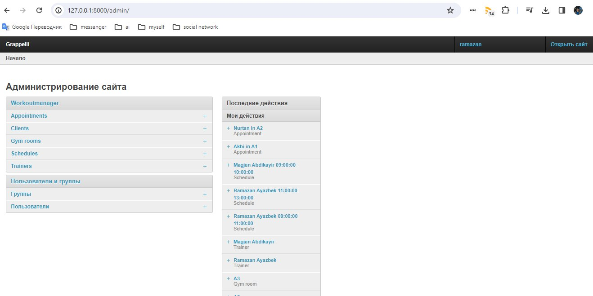
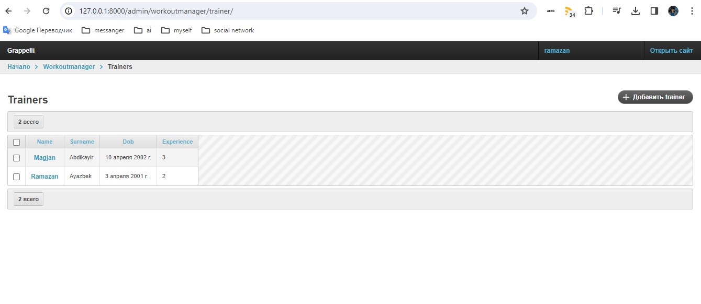
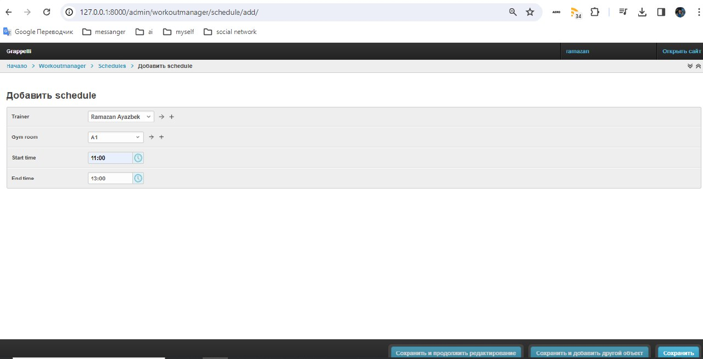
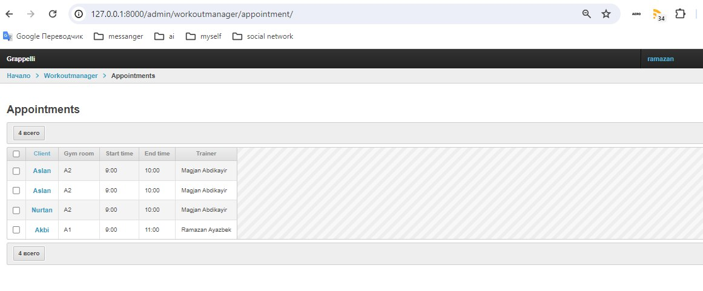
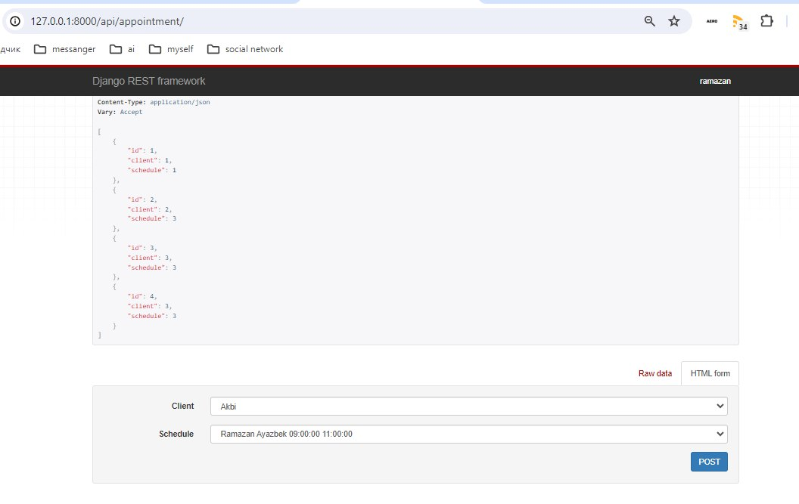
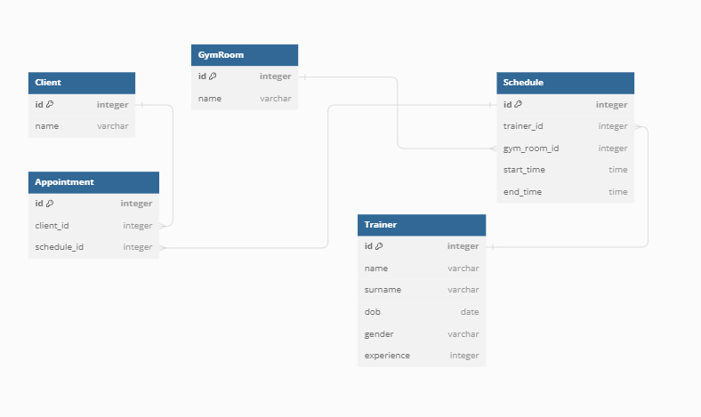

# Fitness Club Management System
Данный проект представляет собой систему управления фитнес-клубом, разработанную с использованием Django Rest Framework. Он предоставляет функциональность для регистрации клиентов, назначения тренеров на занятия, создания расписания занятий в залах фитнес-клуба и записи клиентов на тренировки.

Цель проекта - облегчить управление фитнес-клубом, автоматизировать процессы записи на тренировки, а также предоставить администраторам и тренерам инструменты для эффективного управления занятиями и клиентами.


## Инструкции по установке
1. Клонируйте репозиторий на локальную машину:
```
https://github.com/RamazanAyazbek/Fitness_Task.git
```
2. Перейдите в каталог проекта
```
cd Fitness_Task
```
3. Установите зависимости:
```
pip install -r requirements.txt
```
4. Примените миграции для базы данных:
```
python manage.py migrate
```
5. Запустите сервер разработки:
```
python manage.py runserver
```

## Примеры использования: 
1. После запуска проекта, перейдите по адресу 
```http://127.0.0.1:8000/admin/``` для доступа к админ-панели Django.

2.Управление клиентами, управление тренерами, управление залами фитнес-клуба:
 - Добавление новых пользователи(тренер, клиент, новый зал).
 - Редактирование информации о существующих пользователи.
 - Просмотр списка всех пользователи и их данных.
 
3. Управление расписанием занятий:
- Создание новых расписаний для тренеров и залов.
- Редактирование существующих расписаний.
- Просмотр списка всех расписаний и их деталей.

4. Управление записями клиентов на тренировки:
- Создание новых записей для клиентов на тренировки.
- Редактирование существующих записей.
- Просмотр списка всех записей и их деталей.


5. Создание записи через API



## Структура моделей и связей между ними

